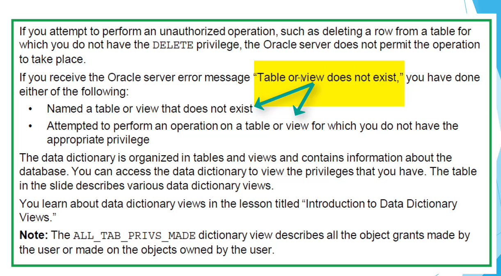

# Controlling User Access:

2 types of security:
- System security
- Data security

A privilege is the right to execute particular SQL statements. The database adminisistrator
DBA is a high level user with the ability to create users and grant users access to the database and its
objects. Users require system privileges to gain access to the database and object privileges to manipulate the content of the objects in the database. Users can also be given the privilege to grant
additional privilege to other users or to roles, which are named groups of related privileges.

A schema is a collection of objects, such as tables, views and sequences. The schema is owned by a db user
and has the same name as that user. A system privilege is the right to perform a particular action,
or to perform an action on any schema objects of a particular type. An object privilege provides the user
the ability to perform a particular action on a specific schema objects

## System privileges:
- More than 200 privileges available
- The db administrator has high level system privileges for tasks such as
    - Creating new users
    - Removing users
    - Removing table
    - Backing up tables

Table SYSTEM_PRIVILEGE_MAP contains all the system privileges available

- Create session privilege is necessary if the user wants to connect to the database

## Roles:
A role is a named group of related privileges that can be granted to the user. This method makes it easier to revoke and maintain privileges. A user can have access to several roles, and several users
can be assigned the same role. Roles are typically created for a database application. 

## Object privileges:

(onderzoek dit!!!)

Worth knowing dat bv het verschil is tussen create table and create any table is dat het verschil is tussen een create table privilege en een create any table privilege is dat bij een create table privilege die user alleen in zijn schema een tabel kan maken terwijl bij create any table die user een table kan maken in any schema

The GRANT OPTION is not valid when granting an object privilege to a role. Oracle prevents the propagation of object privileges through roles so that grantees of a role cannot propagate object privileges received by means of roles.

- You **can** grant role and system privileges in one statement
- you **cannot** grant system and object privileges in one statement
