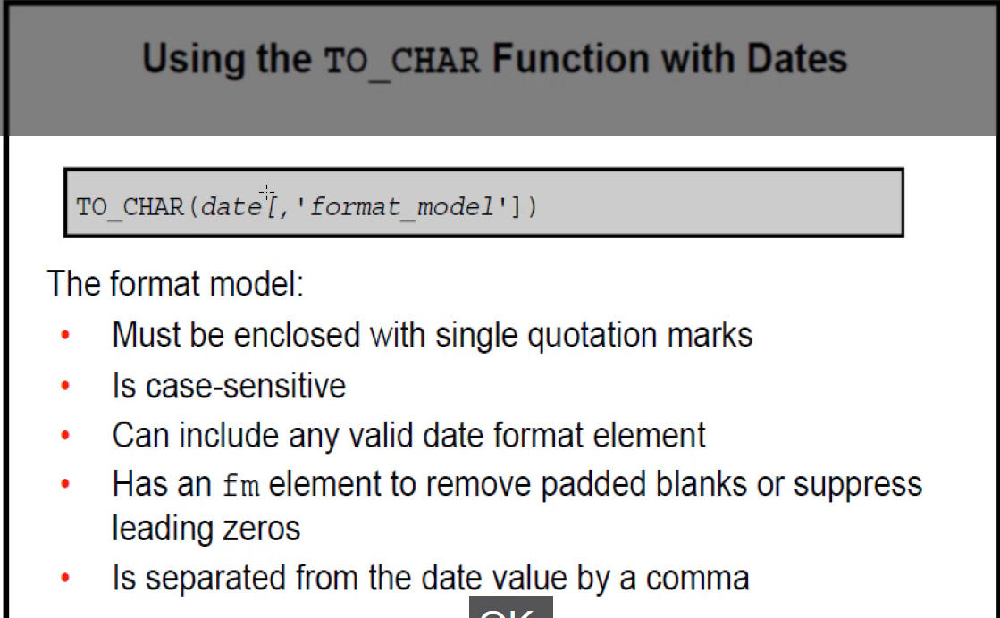
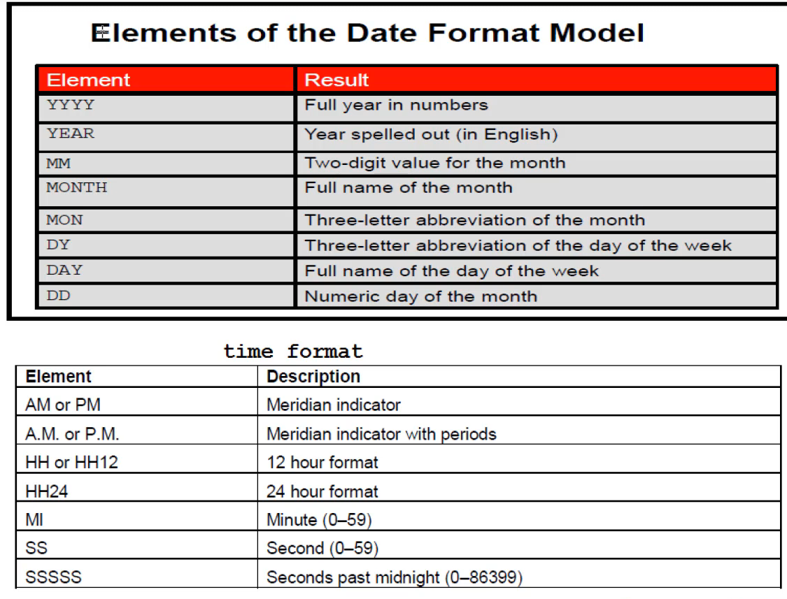
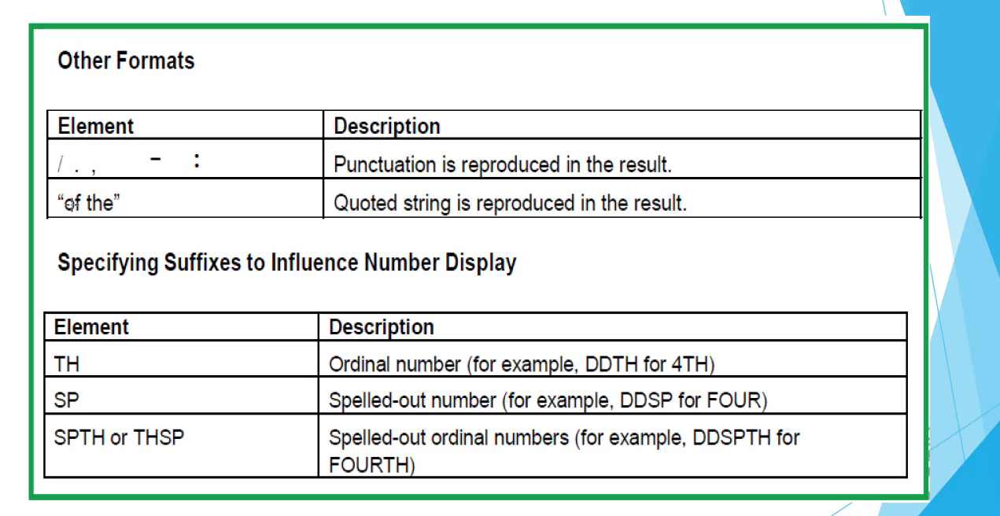
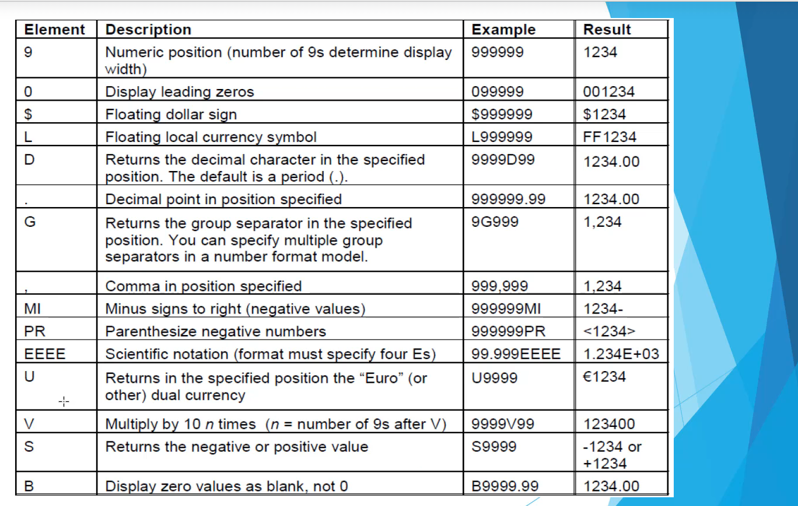

- [Expressions](#expressions)
- [Expression evaluation](#expression-evaluation)
- [Explicit data type conversion](#explicit-data-type-conversion)
- [to\_char:](#to_char)

### Expressions
als je doet
select * from employees where employee_id = '100'
dan convert het die varchar(since its between quotations automatisch om naar number(the actual datatype of the column))
Oracle convert het alleen naar een number als je number between quotations actually een valid number is

select * from employees where hire_date='21-SEP-05';
dit wordt automatisch convert naar datum. Dit is gewoon een string since yk je geen gebruik maakt van to_date or sth
wordt converted naar date omdat het het een valid date vindt dd-MON-RR

### Expression evaluation

select concat(EMPLOYEE_ID, FIRST_NAME) as stuff,
concat(HIRE_DATE, FIRST_NAME) from EMPLOYEES;

-Bv hier wordt je employee_id automatisch convert naar een varchar and bij je hire_date wordt die automatisch convert naar een varchar also

Although implicit data type conversion is available, it is recommended that you use explicit data type conversion for readibility of your statements

### Explicit data type conversion

**explicit data type conversion functions**:
- to_date
  - convert van varchar naar date bv
- to_char
  - convert van date naar varchar bv
- to_number
  - convert van varchar naar number bv 

### to_char:

# Very important

### General functions

### Conditional expressions
-Providing the use of if-then-else within an sql statement

