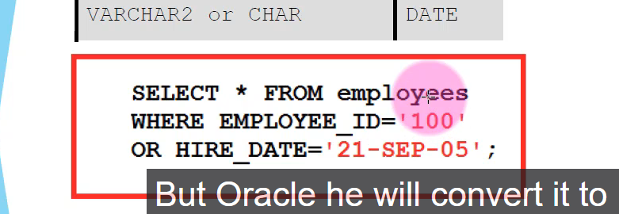

# General tips:

1. Je where statement wordt als eerste executed so you cant use column aliases there:
However you can use column aliases in order by and having

## not so general tips???
1. Bij substring en instring dont forget dat je spaces ook included worden
2. Bij instring al begin je vanaf achterin met tellen(so in reverse) die return value van die index gaat nog steeds vanaf voorin zijn
3. Can't trim in the middle

## Data conversion
Er bestaan 2 soorten conversions:
implicit data conversion  => done by oracle
explicit data conversion => done by the user itself

