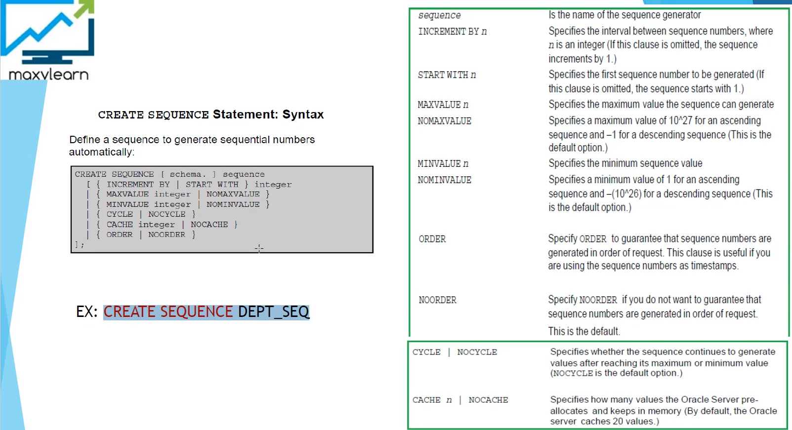
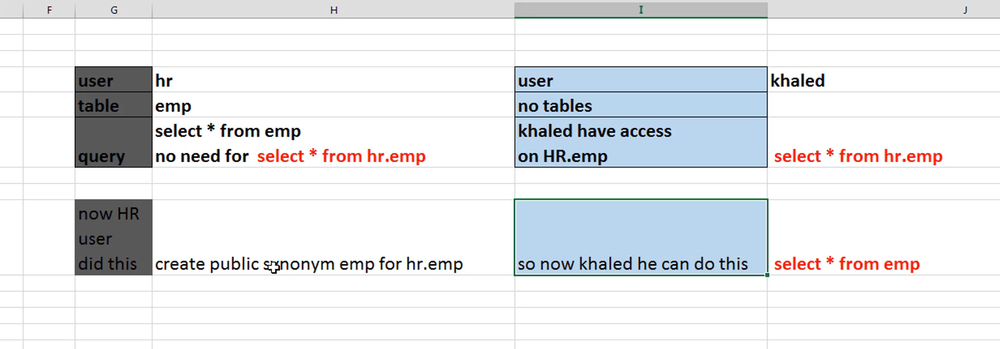
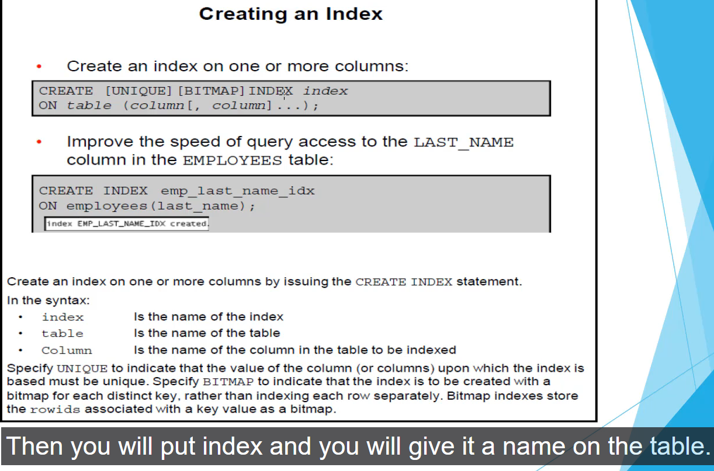

## Sequences:
- Automatically generates unique numbers
- Is shareable object
- Can be used to create a PK value
- Replaces application code
- Speeds up the efficiency of accessing sequence values when cached in memory

**Rules:**
You can use nextval and currval in the following contexts:
- select list of a select statement that is not part of a subquery
- select list of a subquery in an insert statement
- values clause of an insert statement
- set clause of an update statement

You can not use nextval and currval in the following contexts:
- select list of a view
- select statement with the distinct keyword
- select statement with group by, having, order clause
- a subquery in a select, update delete statement

## Psuedocolumns:
- A column which u can use in a select statement, but this column isn't a part of the original table

## Synonyms

- Is a database object
- Can be created to give an alternative name to a table or to another database object
- Requires no storage other than its definition in the data dictionary
- Is useful for hiding the identity and location of an underlying schema object

In order to create a public synonym he has to have a privilege called create public synonym

**You can have:**
- Table and Public Synonym with the same name
- Public Synonym and Private Synonym with the same name

But can not have:
- Table and Private Synonym with the same name inside the same schema

## Indexes:
- Is a schema object
- Can be used by Oracle server to speed up the retrieval of rows by using a pointer
- Can reduce disk input/output(I/O) by using a rapid path access method to locate data quickly
- Is dependent on the table that it indexes
- Is used and maintained automatically by the Oracle Server

If you do not have an index on the column, a full table scan occurs. An index provides direct and fast access to rows in a table. Its purpose is to reduce the disk I/O by using an indexed path to locate data quickly. An index is used and maintained automatically by the Oracle sevrer. After an index is created no direct activity is required by the user.

Indexes are logically and physically independent of the data in the objects with which they are associated.This means that they can be created or dropped at any time, and have no effect on the base tables or other indexes. 
When you drop a table, the corresponding indexes are also dropped. 

## How are indexes created?
Automatically. Oracle will automatically create a unique index when you define a primary key or unique constraint in a table definition.
The name of index will be as the constraint name. 

Manually => You can create unique or nonunique index on columns to speed up access to the rows
Bij manually bv You can create the FK column index for a join in a query to improve the speed of retrieval.

**Note:** You can manually create the unique index, but it is recommended that you create an unique constraint, 
which implicitly creates a unique index.

## Index creation guidelines:**
**Do create an index when:**
- A column contains a wide range of values
- A column contains a large number of null values
- One or more columns are frequently used together in a where clause or a join condition
- The table is large and most queries are expected to retrieve less than 2% to 4% of the rows in te table

- The columns are not often used as a condition in the query
- The table is small or most queries are expected to retrieve more than 2% to 4% of rows in the table
- The table is updated frequently(bc everytime a record is inserted, updated or deleted the index needs to be modified to reflect the changes)
- The indexed columns are referenced as part of an expression
- A descending index is a function based index
- you can create unique and nonunique index on one column
- B tree index is your standard index type
- However, a column that is marked as unused is not displayed in queries or data dictionary views, and its name is removed so that a new column can reuse that name. All constraints, indexes, and statistics defined on the column are also removed."

Bitmap indexes zijn als je wilt pointen naar distinct values rather than each row seperately. Dus basically a group of values. Stel je
voor dat je een column gender hebt. Gender kan maar 2 values hebben. M of F. Rather than point to each row seperately just point to
either the group of values which are M or the group of values that are Ff

