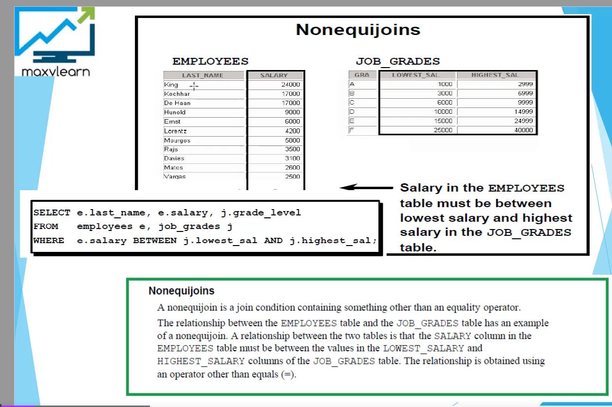

# Joins

## A Cartesian product is formed when:
 - A Join condition is omitted
 - A join condition is invalid
 - All rows in the first table are joined to all rows in the second table

To avoid a Cartesian product, always include a valid join condition in your where clause

## Old joins:
- Equijoins
  - Equijoins worden ook wel simple joins of inner joins genoemd
- Nonequijoin
    A nonequijoin is a join condition containing sth other than an equality operator
    

- Outer join

emp id 5 heeft geen department, zo als je een normale join zou gebruiken(emp.dept_id=dept.dept_id) dan zou Nader niet included zijn
Daarom gebruiken we outer join(+). Deze plaats je altijd aan de kant van de missing data(in dit geval natuurlijk de dept.dept_id)
dat is die missing side, omdat bij Nader die dept_id null is en er is geen null value in je departments table, vandaar dat daar die missing data is
If a fk in table 1 has null values and it is the main table that you want to display data from, then the outer join
should be table2 which has the reference from table1
 - where emp.dept_id=dept.dept_id(+)
  You can also use an outer join to also see rows that do not meet the join condition. The outer join operator is the plus sign

- Self join

## New joins:
- Cross join:
  produces the cross product of 2 tables
  The same as cartesian product between 2 tables

- Natural join:
  Based on all columns in the two tables that have the same name
  It selects rows from the two tables that have equal values in all matched columns
  If the columns having the same name have a different data type then an error is returned

- Using clause:
  If several columns have the same names but the data types do not match, the natural join clause can be modified with the using clause
  to specify the columns that should be used for an equijoin
  Note: Use the using clause to match only one column when more than one column matches
- Do not use a table name or alias in the referenced columns
- The natural join and using clause are mutually exclusive