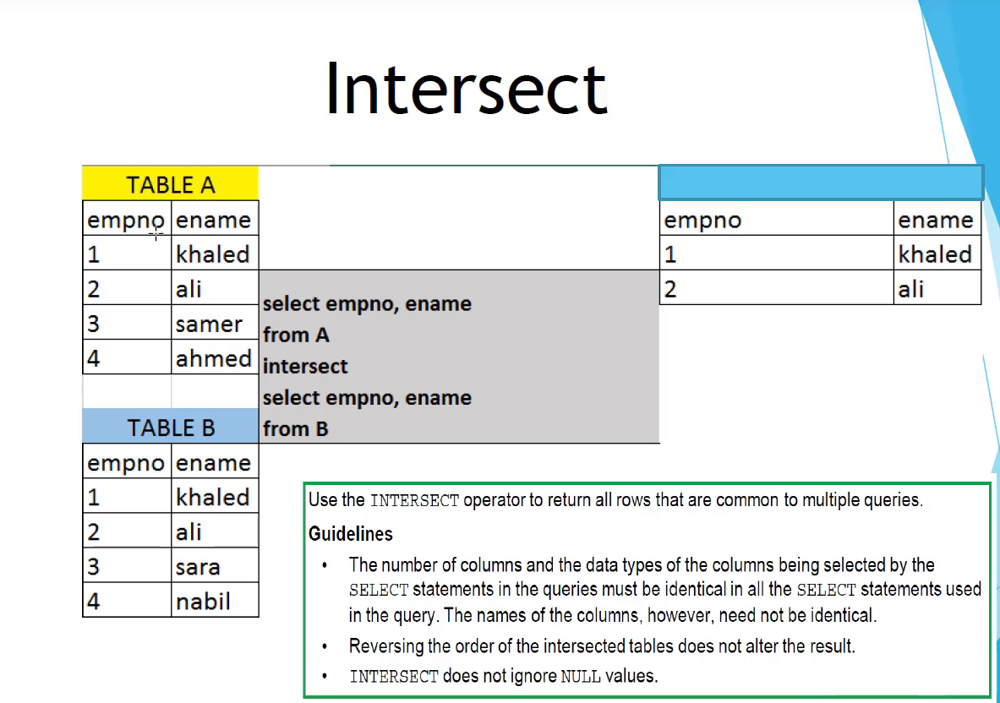
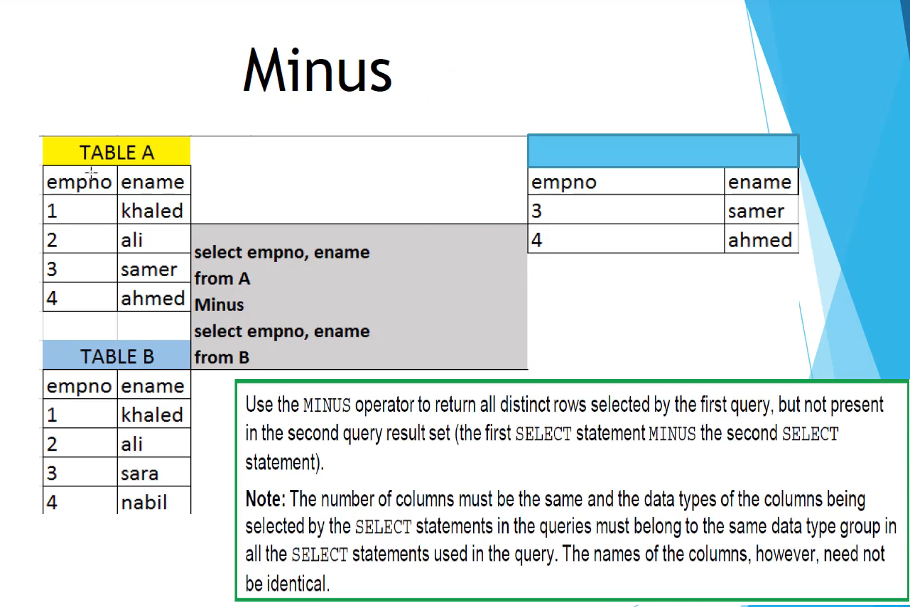

# Set Operators

Set operators combine the results of two or more component queries into one result.
Queries containing set operators are called compound queries

1. Union => Rows from both tables after eliminating duplicates
2. Union all => Rows from both tables including duplicates
3. intersect => Rows that are common to both queries
4. Minus => Rows in the first query that are not present in the second query

## Union 

- Bij union moet je hetzelfde aantal kolumns selecteren
- The data types of the columns being selected must be the same 
- No implicit conversions?
- The names of the columns **dont** need to be identical
- Union operates over all the columns being selected
- Null values are not ignored during duplicate checking
- By default, the output will generally be sorted in the order the rows were inserted

## Union all
The guidelines for them are the same **except for the following two reasons:**
- Duplicate rows are not eliminated 
- Output is not sorted by default

## Intersect 

The number of columns and the data types of the columns being selected by the select statement in the queries
must be identical in all the select statements used in the query. The names of the columns, however **don't** need to be identical
Reversing the order of the intersected tables does not alter the result
Intersect doesn't ignore null values

## Minus

Use the minus operator to return all distinct rows selected by the first query, that aren't present in the 2nd query result set.
So basically the first select statement minus the second select statement
