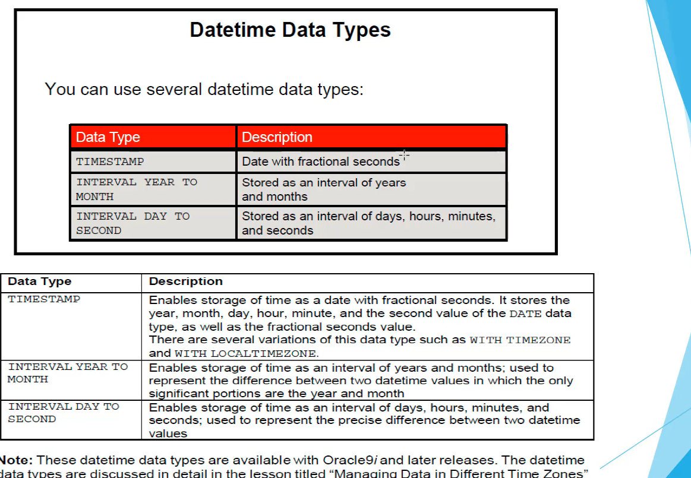
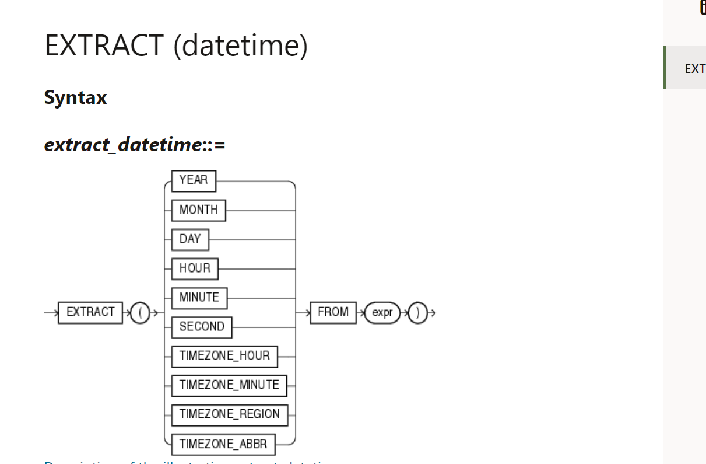

# Datetime data types

Several options datetime data types:
- Timestamp => Date with fractional seconds
- Interval year to month => Stored as an interval of years and month(year can be any positive or negative number)
- Interval day to second => Stored as interval of days, hours, minutes and seconds(day can be any positive or negative number)(also stores fractional seconds)

https://docs.oracle.com/en/database/oracle/oracle-database/19/sqlrf/EXTRACT-datetime.html#GUID-36E52BF8-945D-437D-9A3C-6860CABD210E

## Timestamp:
- Sysdate returns the current date and time for the server
- current_timestamp returns the current date and time for user session(timestamp with timezone)
  The session for the user could be different from the server. The dba can change the user session
  according to location

  

  Great question! The timezone adjustment in a "timestamp with local timezone" data type is based on the timezone setting of the database session or the client session that accesses the data. Let me break it down for you:

Database Session Timezone: When you insert or update data into a column with the "timestamp with local timezone" data type, the database uses the timezone setting of the current database session to determine how the timestamp should be adjusted. So, it's like the timestamp is "stamped" with the timezone information of the session that performs the operation.

Client Session Timezone: When a client application or a user queries data from a "timestamp with local timezone" column, the database uses the timezone setting of the client session to adjust the timestamp. So, if a user in New York queries the data, they will see the timestamp adjusted for the New York timezone. And if another user in Tokyo queries the same data, they will see the timestamp adjusted for the Tokyo timezone.

This means that different users accessing the same data from different parts of the world will see the timestamps adjusted according to their own timezones. It's like each user gets their own personalized version of the timestamp based on their location.

Additionally, the "timestamp with local timezone" data type takes into account daylight saving time (DST) changes and historical timezone adjustments, making it aware of any time zone changes that may have occurred in the past.

So, in summary, the "timestamp with local timezone" data type uses the timezone information of the database or client session to automatically adjust the timestamp, allowing each user to see the timestamp in their local time zone, making it convenient for users across different regions.